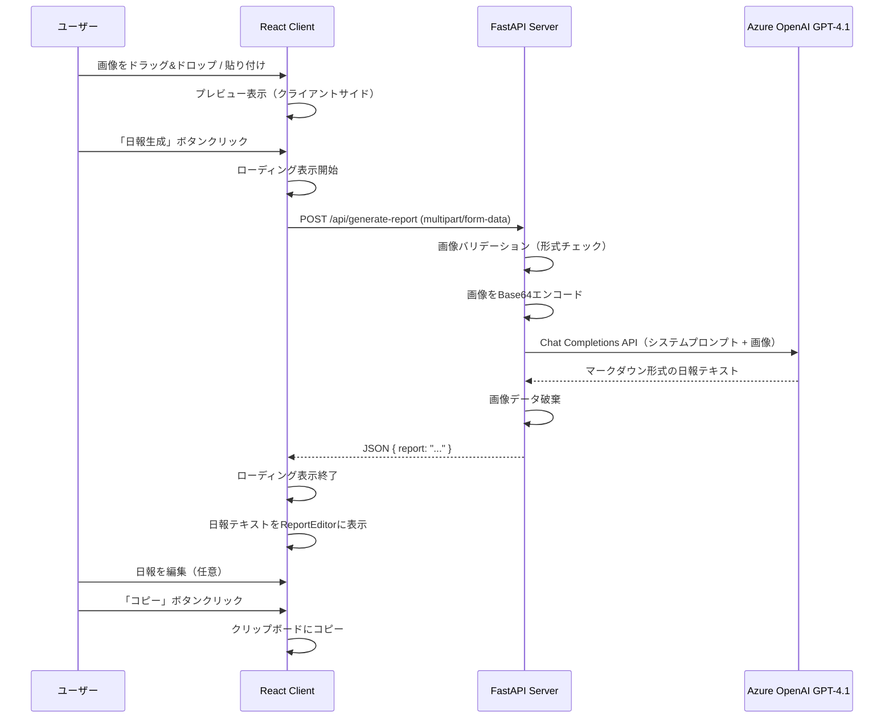
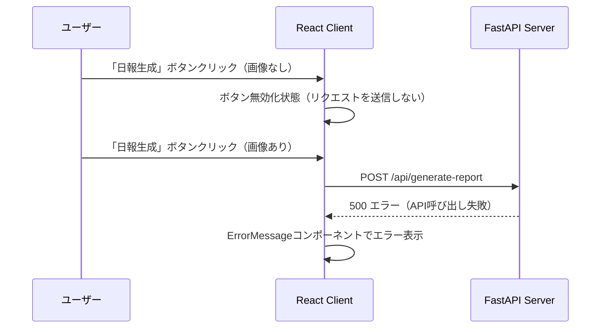

# 日報自動生成アプリ — 技術設計書

## 1. アーキテクチャ概要

```
┌──────────────────┐     multipart/form-data      ┌──────────────────┐     REST API      ┌──────────────────────┐
│                  │  ──────────────────────────▶  │                  │  ─────────────▶   │                      │
│   React Client   │     POST /api/generate-report │   FastAPI Server │                   │  Azure OpenAI        │
│   (Vite + TS)    │                               │   (Python)       │                   │  GPT-4.1 Multimodal  │
│                  │  ◀──────────────────────────  │                  │  ◀─────────────   │                      │
│   localhost:3000  │     JSON { report: "..." }   │   localhost:8000  │     completion    │                      │
└──────────────────┘                               └──────────────────┘                   └──────────────────────┘
```

- **フロントエンド**: Vite + React + TypeScript（`client/`）
- **バックエンド**: Python FastAPI（`server/`）
- **AIモデル**: Azure OpenAI GPT-4.1（マルチモーダル）
- **データベース**: 使用しない
- **通信**: REST API（JSON + multipart/form-data）

---

## 2. ディレクトリ構成

```
/workspaces/ai-coding-bootcamp/
├── client/                          # フロントエンド（Vite + React + TypeScript）
│   ├── public/
│   ├── src/
│   │   ├── components/
│   │   │   ├── ImageUploader.tsx    # ドラッグ&ドロップ・クリップボード貼り付けエリア
│   │   │   ├── ImagePreview.tsx     # アップロード画像一覧・個別削除
│   │   │   ├── GenerateButton.tsx   # 日報生成ボタン（ローディング・無効化制御）
│   │   │   ├── ReportEditor.tsx     # 日報表示・編集テキストエリア
│   │   │   ├── CopyButton.tsx       # クリップボードコピーボタン
│   │   │   └── ErrorMessage.tsx     # エラーメッセージ表示
│   │   ├── hooks/
│   │   │   └── useReportGenerator.ts  # API呼び出し・状態管理カスタムフック
│   │   ├── services/
│   │   │   └── api.ts               # APIクライアント（fetch wrapper）
│   │   ├── types/
│   │   │   └── index.ts             # 型定義（UploadedImage, ReportResponse等）
│   │   ├── App.tsx                   # メインアプリコンポーネント
│   │   ├── App.css                   # スタイル
│   │   └── main.tsx                  # エントリポイント
│   ├── index.html
│   ├── package.json
│   ├── tsconfig.json
│   └── vite.config.ts
├── server/                          # バックエンド（Python FastAPI）
│   ├── main.py                      # FastAPIアプリ・エンドポイント定義
│   ├── config.py                    # 環境変数読み込み（python-dotenv）
│   ├── services/
│   │   └── openai_service.py        # Azure OpenAI API連携サービス
│   ├── models/
│   │   └── schemas.py               # Pydanticスキーマ定義
│   ├── requirements.txt             # Python依存パッケージ
│   ├── .env.example                 # 環境変数テンプレート
│   └── tests/
│       ├── test_main.py             # エンドポイント単体テスト
│       └── test_openai_service.py   # OpenAIサービス単体テスト
├── docs/
│   ├── daily-report-app-meeting.md  # 議事録
│   └── spec/
│       ├── requirements.md          # 要件定義書
│       ├── design.md                # 技術設計書（本ドキュメント）
│       └── tasks.md                 # 実装タスク一覧
├── .gitignore
└── README.md                        # プロジェクト概要・起動手順
```

---

## 3. APIエンドポイント設計

### 3.1 POST /api/generate-report

日報生成エンドポイント。複数の画像ファイルを受信し、Azure OpenAI GPT-4.1 で日報を生成して返す。

**リクエスト:**

```
Content-Type: multipart/form-data

files: File[] (複数画像ファイル, image/png | image/jpeg | image/gif | image/webp)
```

**レスポンス（成功 200）:**

```json
{
  "report": "## 作業内容\n- ...\n\n## 進捗状況\n- ...\n\n## 課題・問題点\n- ..."
}
```

**エラーレスポンス:**

| ステータス | ケース | レスポンス |
|-----------|--------|-----------|
| 400 | 画像ファイルなし | `{ "detail": "画像ファイルが添付されていません" }` |
| 400 | 不正な画像形式 | `{ "detail": "サポートされていない画像形式です: {format}" }` |
| 500 | Azure OpenAI API呼び出し失敗 | `{ "detail": "日報の生成に失敗しました。しばらくしてから再度お試しください" }` |

### 3.2 GET /api/health

ヘルスチェックエンドポイント。

**レスポンス（成功 200）:**

```json
{
  "status": "ok"
}
```

---

## 4. データフロー

### 4.1 シーケンス図



### 4.2 エラーフロー



---

## 5. コンポーネント設計

### 5.1 フロントエンド コンポーネント階層

```
App
├── ImageUploader        # 画像ドラッグ&ドロップ・貼り付けエリア
├── ImagePreview         # アップロード済み画像一覧（サムネイル + 削除ボタン）
├── GenerateButton       # 日報生成ボタン（ローディング中・画像なし時は無効化）
├── ReportEditor         # 日報テキスト表示・編集（textarea）
├── CopyButton           # クリップボードコピーボタン
└── ErrorMessage         # エラーメッセージ表示
```

### 5.2 状態管理

`App.tsx` で以下の状態を管理し、各コンポーネントにpropsとして渡す：

| 状態 | 型 | 初期値 | 管理主体 |
|------|----|--------|---------|
| `images` | `UploadedImage[]` | `[]` | App（useState） |
| `report` | `string` | `""` | App（useState） |
| `isLoading` | `boolean` | `false` | useReportGenerator |
| `error` | `string \| null` | `null` | useReportGenerator |

### 5.3 型定義

```typescript
// types/index.ts

interface UploadedImage {
  id: string;        // crypto.randomUUID() で生成
  file: File;        // 元のFileオブジェクト
  previewUrl: string; // URL.createObjectURL() で生成
}

interface ReportResponse {
  report: string;    // マークダウン形式の日報テキスト
}

interface ApiError {
  detail: string;    // エラーメッセージ
}
```

### 5.4 カスタムフック

```typescript
// hooks/useReportGenerator.ts

interface UseReportGeneratorReturn {
  report: string;
  isLoading: boolean;
  error: string | null;
  generateReport: (images: UploadedImage[]) => Promise<void>;
  setReport: (report: string) => void;  // 編集用
  clearError: () => void;
}
```

---

## 6. バックエンド設計

### 6.1 モジュール構成

| モジュール | 責務 |
|-----------|------|
| `main.py` | FastAPIアプリ初期化、CORS設定、エンドポイント定義 |
| `config.py` | 環境変数読み込み（python-dotenv）、設定値のバリデーション |
| `services/openai_service.py` | Azure OpenAI API連携（画像エンコード、プロンプト構築、API呼び出し） |
| `models/schemas.py` | Pydanticスキーマ（レスポンスモデル） |

### 6.2 環境変数

```bash
# .env.example
AZURE_OPENAI_API_KEY=your-api-key-here
AZURE_OPENAI_ENDPOINT=https://your-resource.openai.azure.com/
AZURE_OPENAI_DEPLOYMENT=gpt-4.1
AZURE_OPENAI_API_VERSION=2024-12-01-preview
```

### 6.3 Pydanticスキーマ

```python
# models/schemas.py
from pydantic import BaseModel

class ReportResponse(BaseModel):
    """日報生成レスポンス"""
    report: str

class HealthResponse(BaseModel):
    """ヘルスチェックレスポンス"""
    status: str
```

### 6.4 Azure OpenAI プロンプト設計

**システムプロンプト:**

```
あなたは日報作成アシスタントです。
ユーザーから提供されるPCの作業画面のスクリーンショットを分析し、
以下の3セクション構成でマークダウン形式の日報を生成してください。

## 作業内容
- スクリーンショットから読み取れる具体的な作業内容を箇条書きで記述

## 進捗状況
- 作業の進捗に関する記述を箇条書きで記述

## 課題・問題点
- 発見された課題や問題点があれば箇条書きで記述（なければ「特になし」）

注意事項:
- 日本語で出力すること
- 各セクションは箇条書き形式で記述すること
- スクリーンショットから読み取れる情報のみに基づくこと
- 個人情報や機密情報が含まれる場合は伏字にすること
```

### 6.5 画像処理フロー

1. `UploadFile` からバイナリデータを読み込み
2. 画像形式の検証（PNG, JPEG, GIF, WebP のみ許可）
3. Base64エンコード
4. Azure OpenAI Chat Completions API に `image_url` として送信
5. 処理後にメモリから破棄（変数スコープ終了で自動GC）

---

## 7. CORS設定

```python
# main.py
from fastapi.middleware.cors import CORSMiddleware

app.add_middleware(
    CORSMiddleware,
    allow_origins=["http://localhost:3000"],  # フロントエンド開発サーバー
    allow_credentials=True,
    allow_methods=["GET", "POST"],
    allow_headers=["*"],
)
```

開発時は Vite の `proxy` 設定も併用し、CORSの問題を回避する：

```typescript
// vite.config.ts
export default defineConfig({
  server: {
    port: 3000,
    proxy: {
      '/api': {
        target: 'http://localhost:8000',
        changeOrigin: true,
      },
    },
  },
});
```

---

## 8. エラーハンドリングマトリックス

| エラー場面 | フロントエンド | バックエンド |
|-----------|--------------|------------|
| 画像未選択で生成ボタン押下 | ボタン無効化（`disabled`）により発生しない | — |
| 不正な画像形式 | — | 400 レスポンス + `detail` メッセージ |
| Azure OpenAI API 呼び出しタイムアウト | ErrorMessage でエラー表示 | 500 レスポンス + ログ出力 |
| Azure OpenAI API キー未設定 | — | サーバー起動時にログ警告 |
| ネットワークエラー（フロント→バックエンド間） | ErrorMessage でエラー表示（`fetch` の catch） | — |
| 画像サイズ超過 | — | 413 レスポンス（FastAPI デフォルト） |

---

## 9. テスト戦略

### 9.1 バックエンド単体テスト

- **`test_main.py`**: FastAPI `TestClient` を使用したエンドポイントテスト
  - ヘルスチェック正常応答
  - 画像なしリクエスト → 400
  - 不正画像形式 → 400
  - 正常リクエスト → 200（OpenAI API はモックで差し替え）
- **`test_openai_service.py`**: OpenAIサービスの単体テスト
  - Base64エンコード処理
  - プロンプト構築処理
  - API呼び出し（モック使用）

### 9.2 フロントエンド手動テスト

| テスト項目 | 手順 | 期待結果 |
|-----------|------|----------|
| 画像ドラッグ&ドロップ | 画像ファイルをドロップエリアにドラッグ | プレビューに画像が表示される |
| 複数画像アップロード | 2枚以上の画像を追加 | すべてプレビューに表示される |
| 画像削除 | 削除ボタンをクリック | 対象画像がプレビューから消える |
| 日報生成 | 画像追加後に生成ボタンをクリック | ローディング → 日報テキスト表示 |
| 日報編集 | テキストエリアの内容を変更 | 変更が即反映される |
| コピー | コピーボタンをクリック | 別エディタに貼り付けで確認 |
| エラー表示 | バックエンド停止状態で生成ボタン | エラーメッセージが表示される |

---

## 10. デプロイ構成

### 開発環境（ローカル）

```
DevContainer (Python 3.12 + Node.js)
├── server: python -m uvicorn server.main:app --reload --port 8000
└── client: npm run dev (port 3000)
```

### 本番環境（将来）

```
Azure App Service
├── FastAPI (server/)  ← Azure App Service
└── React (client/)    ← 静的ファイルをFastAPIから配信、またはAzure Static Web Apps
```

---

## 変更履歴

| 日付 | 変更内容 | 変更者 |
|------|---------|--------|
| 2025-08-28 | 初版作成 | - |
